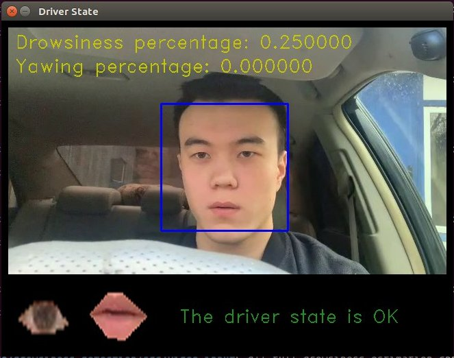
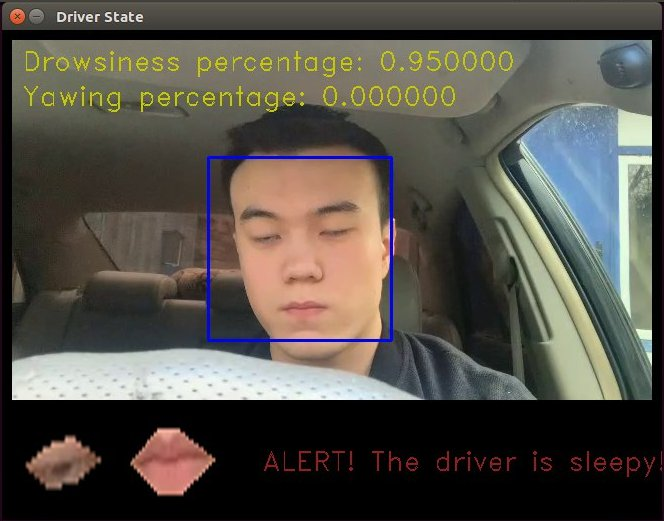
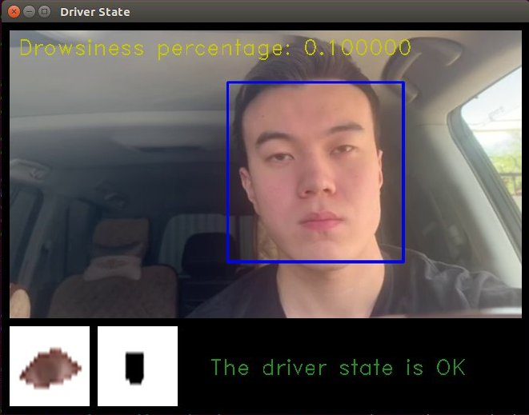
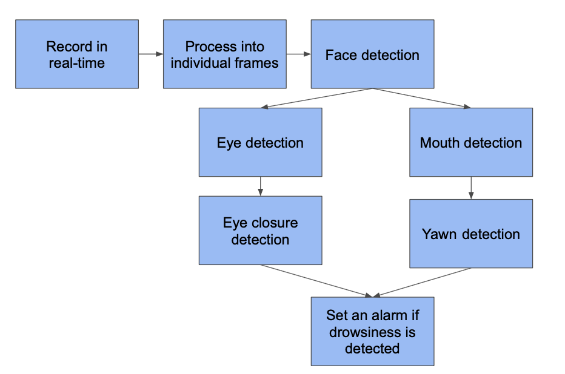
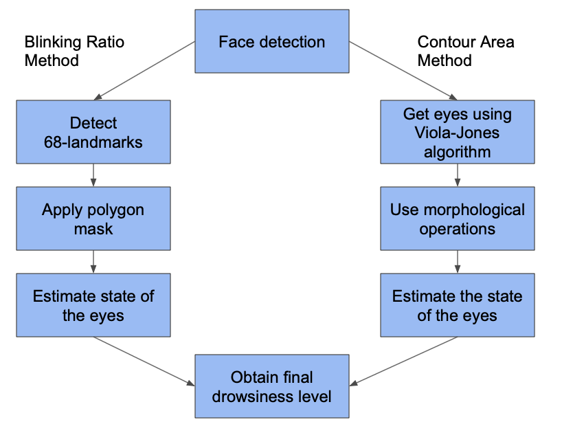

# Driver Drowsiness Detection

This is an open source implementations of the driver drowsiness estimation based on Blink Ratio and Contour Area methods. It gives driver drowsiness estimation in real-time and is based on C++ and OpenCV.

## Driver Drowsiness Detection based on Blink Ratio and Contour Area methods

Focused driver (blink ratio)     |  Drowsy driver (blink ratio)    | Focused driver (area method)
:-------------------------:|:-------------------------:|:-------------------------:
   |   |   

## Prerequisites

* C++11
* OpenCV4

## Running the applications

Firstly navigate to ```src/video_input```

### Blink ratio method
To build and run the Blink ratio method with corresponding interface:

```
g++ full_drowsiness_estimation.cpp -o drowsiness `pkg-config --cflags --libs opencv4` -std=c++11
```

and
```
./drowsiness
```

### Contour Area method
To build and run the Contour Area method:

```
g++ facedet_contour.cpp -o contour `pkg-config --cflags --libs opencv4` -std=c++11
```

and
```
./contour
```


## Details

This implementations based on two methods which are widely used as a drowsiness estimation in research. The algorithm implementation based on the following steps, where the drowsiness is estimated independently:

<!--  -->


More information is available in our paper:
[Driver Drowsiness Detection based on Blink Ratio and Contour Area methods](https://github.com/kurshakuz/drowsiness_detection/blob/master/media/Image_Processing_Final_Project_Report_Driver_Drowsiness_Detection.pdf) 